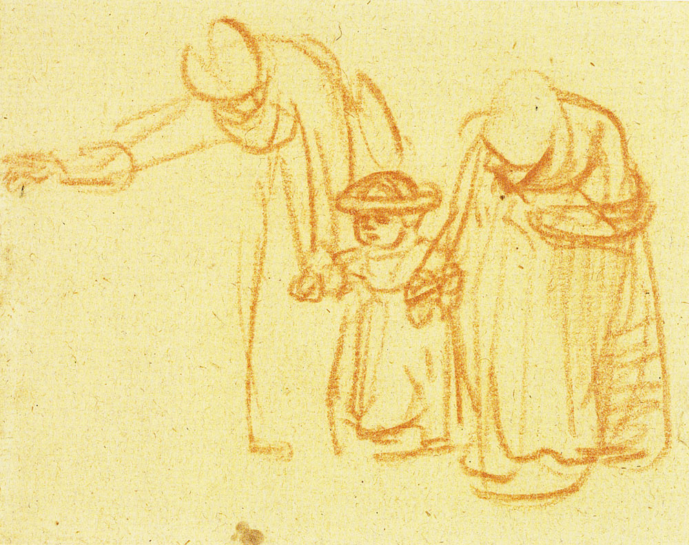

# The ideas

## 1. Giving as a business

The word for the stance is giving as a business: a service earns by what it lets its users compound, not by what it withholds from them.

The author gives the name a second reading, glue as a business: what the walls of today's products sell as integrations, the glue between them, is under [the substrate](../code.md#6-how-far-this-goes) the one honest service, the connecting itself, and a host that offers it is offering glue as a service. The two readings are one stance seen from the user's side and from the host's.

The positions beneath are on how a model and a harness should be offered, begun 2026-09-11 from the labs' cost accounts so the first of them stand beside the numbers that provoked them.

*The author's, marked so, and open.*

[the level beneath](gaab.md)

## 2. Tenants beyond prose

A tenant is a domain that lives in the substrate the way knowledge does. Knowledge is the first, and [the code's sixth section](../code.md#6-how-far-this-goes) says the shape reaches further.

These are the cases as they occur, between the study and the project's vision: each named as it would look as entries in the substrate. Two are domains; the rest are not, and say so where they stand.

*The author's, held open and marked so; begun 2026-09-11.*

[the level beneath](tenants.md)

## 3. How two holons drive each other

The code gives two joins: [a brief holds smaller briefs beneath it](../code.md#321-the-holarchy), and [a link reaches what lies elsewhere](../code.md#322-the-link). Neither is two wholes driving each other at once.

This asks how that is done, by asking it of the one field that has answered it in working machines, and brings back what the answer requires.

*Derived 2026-09-11, from the author's question about resonance between the operators of a synthesizer.*

[the level beneath](resonance.md)

## 4. Letting go by contract

[To debrief](../code.md#55-the-debrief) is to let go: the detail stays beneath, the conclusion goes to the surface, and what the surface keeps is a contraction of what was there. What is kept is typed, or at least categorised, and then it is what a program can take: substrate as argument data. The author's point is that the contraction can be made contractual.

That is the whole of how programs are directed under the medium, a program says what it takes, and a contracted piece of the substrate is handed to it because it matches. So letting go is not loss; it is the making of an interface. Whoever cannot let go cannot direct, because what they hold is not yet in a shape anything can take.

The visual side is the same act felt from the other direction. A drawing is relaxation through contraction: the shape stands and the detail withdraws, and the eye rests on what was kept. Letting go by contract, the author's name for it, is what gives space to other depths, so that where one thing withdraws another can come forward.

An interface that works this way is not in front of the user but around them, a surround user interface: whatever is contracted recedes into the surround, still there, one step away, and the depth in focus has the room.

\
Rembrandt, [two women teaching a child to walk](https://commons.wikimedia.org/wiki/File:Rembrandt_-_Benesch_0421.jpg), in red chalk: three figures stand whole in a few lines, and the detail withdraws.

*Reasoned, the author's thought of 2026-09-11 on how a substrate is let go of gracefully, for a context or for anything else, held open with the names kept as coined; the contract is [the code's sixth section](../code.md#6-how-far-this-goes) and the project's substrate, and the rest is what a surface built on them would feel like.*

## 5. What is told, and what is shown

Knowledge divides into what has to be told and what can be shown. The code is told, and by [lab 10](../study/10-comprehension/debrief.md) it is nearly told. From there the gains move to what is shown: the surface the substrate is read through, and the interface it is worked in. This is the author's split for grading where effort goes next, held 2026-09-11.

In that pair the human's role is the art direction. That is what a person does for a session in a sentence and cannot be computed, and the tools are what carry it. So the split is also a division of labour, and it says where a person's time is worth most as the work moves on.

*Reasoned, the author's, and open; the reason [the surface](../poc/surface/README.md) was taken up before lab ten's piece was read.*
